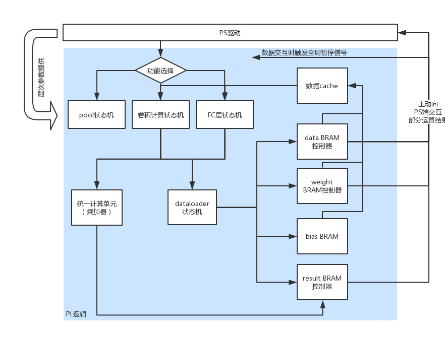
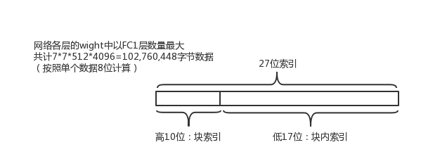
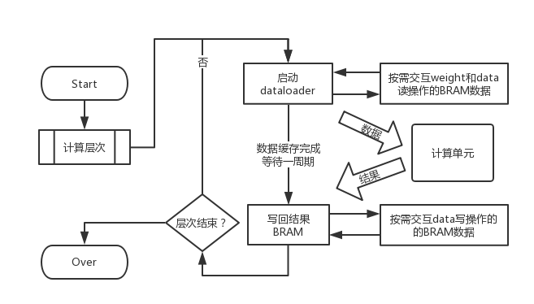
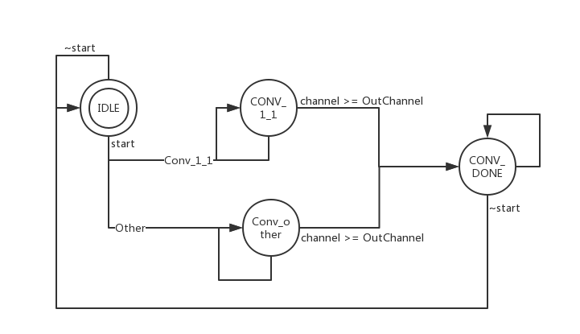
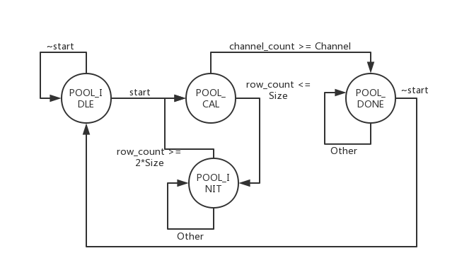
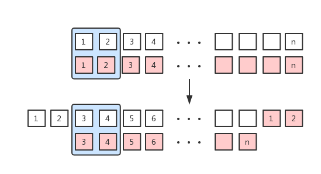
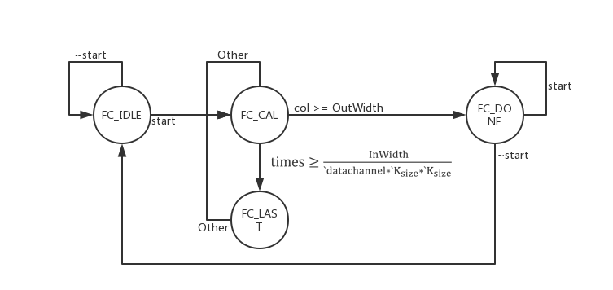
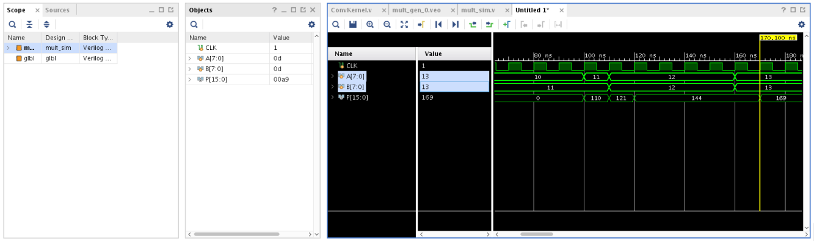
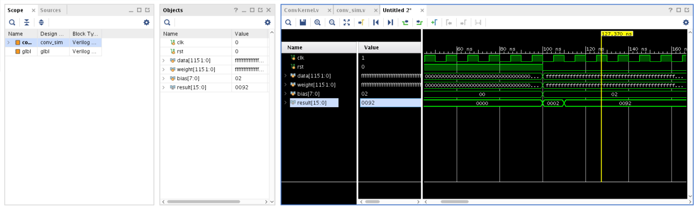
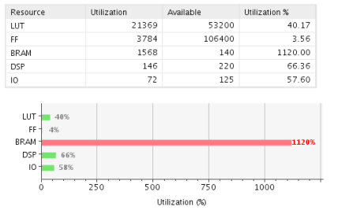

在 Zynq FPGA 上实现 VGG16 网络 实验报告
======================================

2019年01月

设计思路
--------

### 整体架构

为了在硬件平台上实现vgg16网络，首先进行了vgg16的网络特点分析，得到以下结论：

1. vgg16的卷积核尺寸一致，都是3\*3的小卷积核

2.
vgg16虽然卷积层数较多，但每个block的结构是一致的，即“卷积+ReLU+pool”的基础结构

3.
无论是第一层还是之后的层次，一次卷积中（所有卷积核都算在内）的乘法次数都远超过DSP资源的数目（220）个，因此不可能使用一次计算直接计算出任何一个卷积核的最终结果。

基于以上的初步分析，再结合之前的设计经验，在vgg16的硬件实现上，采用了基于参数的计算层的设计，见Figure
1。



Figure 1：整体设计框架

如Figure
1所示，PL端的设计按照实现的功能划分为卷积、全连接和池化三个状态机，每个状态机都能接收PS端的参数完成相应的计算，这样做的好处就是可以使用一个状态机完成所有不同尺寸的功能计算，相比较实验一每层一个状态机的设计虽然代码中的参数计算更为复杂，但使用起来更为便捷，而且降低了修改成本。

BRAM部分使用了类似内存管理中页表的结构，即将BRAM索引的高位作为块索引，地位是实际索引，以weight的访问方式为例，见Figure
2。



Figure 2：weight索引方式示例

采用这样的索引方式主要是由于BRAM的存储资源不足，无论是weight还是data或者result，片上的BRAM资源都无法满足单层运算存储这个最基本的要求，但这些数据访存都具有连续性，因此采用这样的方式，并设置存储器自主管理和PS的交互，这样只需要使用一个17位深度的BRAM（即32片）就可以满足要求，这也是在现有资源的前提下的最大存储深度（32\*4=128\<144）。

功能实现
--------

### 计算通路设计

针对计算数据的初步分析如下：

表格 1：卷积计算分析

| 层次    | 卷积大小  | 通道数 | 卷积计算次数 |
|---------|-----------|--------|--------------|
| Conv1_1 | 3\*3\*3   | 64     | 224\*224     |
| Conv1_2 | 3\*3\*64  | 64     | 224\*224     |
| Conv2_1 | 3\*3\*64  | 128    | 112\*112     |
| Conv2_2 | 3\*3\*128 | 128    | 112\*112     |
| Conv3_1 | 3\*3\*128 | 256    | 56\*56       |
| Conv3_2 | 3\*3\*256 | 256    | 56\*56       |
| Conv3_3 | 3\*3\*256 | 256    | 56\*56       |
| Conv4_1 | 3\*3\*256 | 512    | 28\*28       |
| Conv4_2 | 3\*3\*512 | 512    | 28\*28       |
| Conv4_3 | 3\*3\*512 | 512    | 28\*28       |
| Conv5_1 | 3\*3\*512 | 512    | 14\*14       |
| Conv5_2 | 3\*3\*512 | 512    | 14\*14       |
| Conv5_3 | 3\*3\*512 | 512    | 14\*14       |

表格 2：全连接计算分析

| 层次 | 单次计算大小 | 计算次数 |
|------|--------------|----------|
| FC1  | 25088        | 4096     |
| FC2  | 4096         | 4096     |
| FC3  | 4096         | 1000     |

注：红色数据用IC表示，蓝色数据用OC表示，黄色数据用S表示，绿色数据用R表示，灰色数据用L表示

以上分析的目的是希望设计出一个基本的计算单元（乘加器）。考虑到当前FPGA片上的DSP资源只有220个，因此不可能一次性计算出一个卷积核（所有通道），而为了拆解计算时方便数据整理，这个计算单元需要尽可能的被计算尺寸整除。考虑到单个卷积核（3\*3）的计算是不可拆解的，因此计算单元的尺寸应为：

$$
3 \times 3 \times n
$$

观察数据，最终选择$$n =
16$$作为计算单元的大小。使用这个计算单元，可以最大程度的利用DSP资源在一个周期内并行完成144\*144个数据的乘加计算，具体到各层，见表格
3。

表格 3：计算单元复用说明

| 功能层次 | 说明                                                                                                                         |
|----------|------------------------------------------------------------------------------------------------------------------------------|
| 卷积层   | 除Conv1_1需要特殊处理之外，其它层均可直接使用计算单元循环IC/16\*S\*OC次实现。其中，IC/16次计算结果求和对应输出数据中的一个点 |
| 全连接层 | FC1中R无法被16整除部分需要补零，其余层可以直接使用计算单元循环R/16\*L次。其中，R/16次计算结果求和对应输出结果的一个点        |

考虑到数据通路中的数据复用问题，因为目前的网络计算量过大，无法通过一次计算得到最终结果，而多次计算需要累加才能得到最终的结果，而且片上缓存资源也不能够满足中间结果的临时缓存，因此无论是输入数据还是卷积核参数的复用性都受到了很大的限制。目前的设计方案中没有针对数据进行复用计算，每次计算都需要从BRAM加载数据到缓存（相当于串行到并行的转换），再进行并行计算。而优化的点在于未得到最终结果时不必写回BRAM，而是利用缓存进行累加，知道得到每个点的最终结果才写回BRAM。

实现中，为了尽可能的减少代码开销，尽可能多的复用状态机，考虑采用表注中的方式将参数进行划分，同一种底色的值使用一个参数表示，这样设计出的状态机就能够使用全部的网络层次计算了。

### 全局计算逻辑



Figure 3：全局计算逻辑示意

如Figure
3所示，网络中无论是卷积计算层还是全连接计算层，基本的计算逻辑是一致的，即：通知dataloader加载数据，加载过程中封装BRAM自行控制PS-PL数据交互，计算单元完成计算，计算数据或临时缓存累加或写回结果位置，结果存储单元自行控制PS-PL交互。这样设计的好处就在于全局的逻辑较为统一，降低了开发过程中流程不一致带来的隐含Bug，而且每个单元耦合度低，职责明确，这样也方便模块化设计。

### 卷积计算子状态机



Figure 4：卷积状态机

卷积状态机负责控制每一个卷积层的计算，其中，主要的计算流程在CONV_1_1状态和CONV_other状态使用循环逻辑完成，流程上与Figure
3所示一致，卷积计算的多层循环可用伪代码描述为：
```python
for channel from 1 to OutChannel
	for pos from 0 to Size*Size
		for times from 0 to InChannel/16
			delay 1 cycle to wait for calculate
			add output of calculate module to result
		write result back to result BRAM
```
设计中，因为只有Conv1_1的输入通道数小于16，也就是无法填满一个计算模块，需要在数据后补充零，因此作为单独一个状态进行处理，其他层都可以使用统一的方式加载并计算。

### Pool计算子状态机



Figure 5：pool子状态机

基于实验一的pool层设计，为了使得pool层能够更加具有通用性并且避免实验一中存在的读写冲突的问题，这次试验中修改了pool层的计算方式，引入了一个cache缓存作为移位寄存器，缓存两行数据，根据输入的矩阵尺寸读取对应位置的最大值并作为结果给出到result的BRAM中。见Figure
6。



Figure 6：移位寄存器示意

这样，pool层的数据流就和其它层次一致了。移位寄存器的使用虽然没有体现数据复用的优势，但对于数据流控制和简化操作还是有很大优势的。

### FC子状态机



Figure 7：FC子状态机

FC子状态机的设计与前述模块思路一致，也是出于对计算模块的复用进行的设计，使得在不增加计算硬件开销的前提下完成矩阵向量乘法运算。其中，FC_CAL状态下采用循环方式完成向量对矩阵中某一列相乘加，并写回计算结果，用伪代码描述为：
```python
for col from 1 to OutWidth
	result **=** 0**;**
	for times from 1 to InWidth/(`datachannel*`K_size*`K_size)
		result **+=** temp_result
	if InWidth%(`datachannel*`K_size*`K_size) == 0
		write back directly
	else
		turn to FC_LAST, continue calculate
```
### ReLU实现

由于vgg16中每层计算都加入了ReLU激活函数，根据ReLU的计算方式——正值保留，负值为零。在实现ReLU的计算时并不需要额外添加模块，利用本设计计算模块统一的特点，只需要在计算结果处进行限制，保留所有正值，同时负值设置为0输出，这样相当于在计算过程中实现了一个inplace
ReLU过程。

问题与分析
----------

### 部分模块仿真结果

基于测试需要，本次试验中针对反复使用的关键模块进行了仿真，以验证设计的正确性。首先是DSP乘法器的仿真，见Figure
8。



Figure 8：DSP仿真结果

虽然乘法器为了最大程度的利用DSP资源而使用了IP和设计，但没有经过仿真波形的验证并不能确定IP核的行为，经过仿真发现，DSP乘法器存在一定的输出延迟，从第一个输入开始之后过大约8个时钟周期才会有输出值，但从产生过第一个输出值开始，之后的输出是只会产生一个周期的延迟。结合项目需求，只需要在输入信号稳定的之后等待一个周期再获取结果，就能够得到正确的运算数据了。对于一开始建立初值的过程，因为有rst复位信号的存在实际上可以忽略不计。

接下来使用DSP乘法器搭建了计算模块，仿真结果见Figure 9。



Figure 9：计算单元仿真结果

计算单元一个周期内完成的运算规模为$$3 \times 3 \times 16 = 144Byte =
1152bits$$的运算，而相应方式和单个DSP的响应时序相同，这一点在仿真结果中可以得到验证。因此，实际应用时，也需要延迟一个周期读取结果才能得到正确的结果。为了实现这一点，在所有引用计算结果的地方都引入了delay信号用来延迟读取设计。
```python
if(times >= InWidth/(`datachannel*`K_size*`K_size))
begin
    stage <= `FC_LAST;
end else if(data_ready & ~delay) begin
    delay <= 1'b1;
    loader_mode <= `LOADER_IDLE;
end else if(delay) begin
    result <= result + temp_result;
    times <= times + 1;
    delay <= 1'b0;
end else begin
    loader_mode <= `LOADER_FC;
end
```

### BRAM资源不足

吸取实验一设计的教训，这次设计在一开始就考虑到了DSP资源数量的问题，并采用的保守设计，在可用的220个DSP资源中只使用了144个用来作为计算单元的基本模块，保证板载资源能够满足要求。但随着设计的进行，出现了BRAM资源不足的问题。



Figure 10：初步设计的资源使用情况

BRAM资源远远超过的板载资源的最大限制条件，之后我进行了数据量的分析，见表格 4。

表格 4：vgg16中的数据量

| 层次     | result数据量       | weight数据量             |
|----------|--------------------|--------------------------|
| INPUT    | 224\*224\*3=150K   | 0                        |
| CONV_1_1 | 224\*224\*64=3.2M  | (3\*3\*3)\*64=1728       |
| CONV_1_2 | 224\*224\*64=3.2M  | (3\*3\*63)\*64=36864     |
| CONV_2_1 | 112\*112\*128=1.6M | (3\*3\*64)\*128=73728    |
| CONV_2_2 | 112\*112\*64=1.6M  | (3\*3\*128)\*128=147456  |
| CONV_3_1 | 56\*56\*256=800K   | (3\*3\*128)\*256=294912  |
| CONV_3_2 | 56\*56\*256=800K   | (3\*3\*256)\*256=589824  |
| CONV_3_3 | 56\*56\*256=800K   | (3\*3\*256)\*256=589824  |
| CONV_4_1 | 28\*28\*512=400K   | (3\*3\*256)\*512=1179648 |
| CONV_4_2 | 28\*28\*512=400K   | (3\*3\*512)\*512=2359296 |
| CONV_4_3 | 28\*28\*512=400K   | (3\*3\*512)\*512=2359296 |
| CONV_5_1 | 14\*14\*512=100K   | (3\*3\*512)\*512=2359296 |
| CONV_5_2 | 14\*14\*512=100K   | (3\*3\*512)\*512=2359296 |
| CONV_5_3 | 14\*14\*512=100K   | (3\*3\*512)\*512=2359296 |
| FC1      | 4096               | 7\*7\*512\*4096=98M      |
| FC2      | 4096               | 4096\*4096=16M           |
| FC3      | 1000               | 4096\*1000=4M            |

从表中可以看出，result数据最大的存储量为3.2M，weight数据的最大存储量为98M，而7020板载的140块BRAM资源只能提供最大4.9M的存储空间，如果采用之前的这几——PS端控制数据全部写入BRAM再计算——会远远超出BRAM的资源限制，因此需要修改设计。

再次分析BRAM的使用情况可以知道，使用BRAM的场景一共有四处——data、result、weight和bias。其中，bias使用的资源最少，这里不做考虑。目标是最大化其他三个存储的资源利用。然而如果对于一个矩阵需要多次加载，势必存在地址计算的问题，而只有对齐的地址值最好计算的，因此这三个存储使用的数据深度只使用2的整数幂，这样能够最大程度的简化地址计算。

最终，结合资源大小，分配给每个存储单元32片BRAM资源，即深度为17位的存储空间，参照Figure
2所示的索引方式，就可以很方便的进行地址索引。并且只在存储器模块内部就能判断是否需要向PS端请求数据，增强的模块的适用性。

为了保证模块请求缺失数据时硬件不会进行错误的操作，本实验采用的保守设计，即在全局范围使用了waiting信号：
```python
if(rst) begin
    // reset signals
end else if(~waiting) begin
	case (stage)
		// FSM control codes
	endcase
end
```

waiting信号在存储器和PS交互时有效，在所有状态机的外层限制：只要waiting有效，所有状态机不进行状态更新。相当于是所有硬件停止工作，等待数据交互，待数据更新正常之后再继续进行计算。

结果与验证
----------

目前本设计的计算与控制模块的Verilog代码已经完成，而且完成了部分的仿真验证工作，但是全局状态机处在仿真验证阶段，数据可以正常传输并正确计算完毕。从仿真结果来看，设计中的数据通路和状态机功能表现正确。但因为完成卷积的仿真时间较长，因此这部分的设计验证工作还未完全完成。

对于block
design的设计，按照现有的bram互联方式连接即可，只需要将部分模块从但接口改成dual
port并设计另外一端为AXI总线接口实现与PS端的数据交互即可。

关于PS的软件设计，也是状态机的形式，转换逻辑与实验一仿真驱动文件逻辑一致，较为简单。PS端的难点在于BRAM请求数据时的响应逻辑，这部分的时序逻辑并不很难，但需要正确地根据硬件信号计算出需要的数据地址并写入到BRAM中。相关的信号已经给出：
```python
input weight_done,          	// control signal
output reg [9:0] block,     	// data signal
output reg waiting
```

其中，waiting信号在控制硬件暂停计算的同时通知PS算请求数据，done信号作为PS端输出的响应信号告知PL数据传输完成，block信号传输给PS请求的是哪部分数据。这样，通过PS端的配合就能够完成整个数据传输过程。
